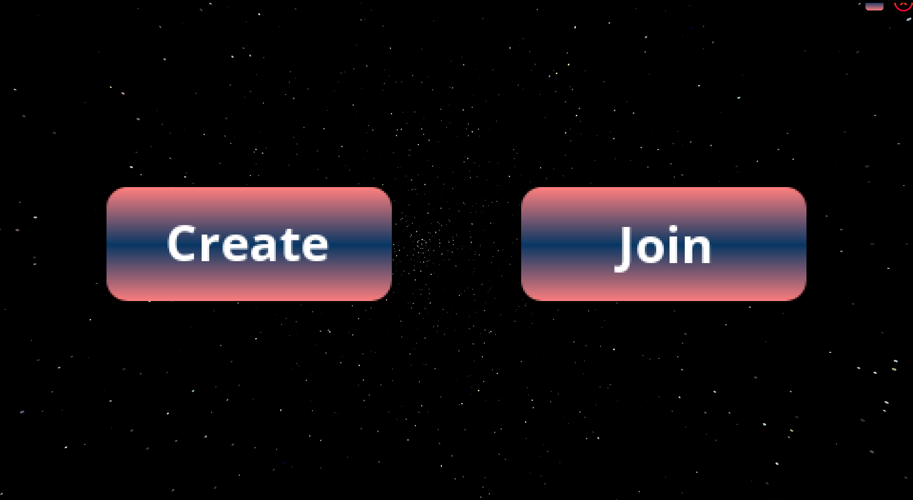
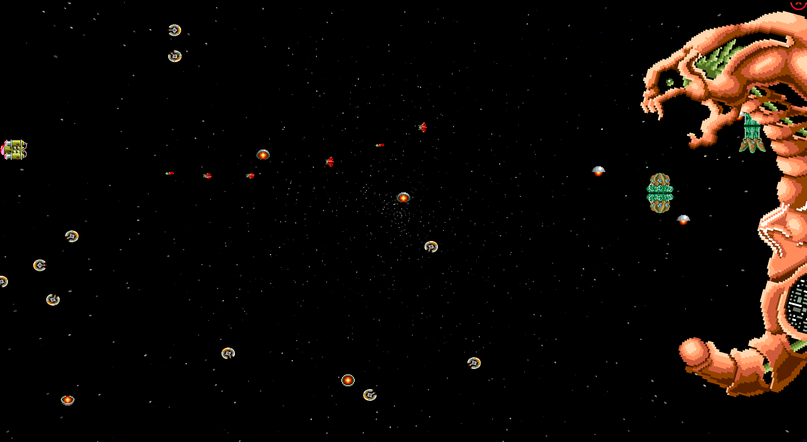

# R-Type Game Engine

## Overview
This repository is dedicated to recreating the classic shoot'em up game R-Type as a multiplayer game using our custom game engine. This project is designed to be cross-platform, supporting both Windows and Linux environments.

### Cross-Platform Compatibility
The project builds differently depending on the OS:
- **Linux:** Use `make` command.
- **Windows:** Execute a `make.bat` file.

### Features
- Modular architecture allowing flexible game development
- Integrated physics and collision detection
- Efficient rendering pipeline optimized for 2D graphics

Each component of the project (game engine, client, server) is built directly with the client and server. There is no separate build for the game engine.

## Building

### Linux
Building the project on Linux involves compiling the client and server executables. After cloning the repository and navigating to the project directory, you should install the dependencies then use the `make` command to compile.

```bash
git clone https://github.com/EpitechPromo2027/B-CPP-500-STG-5-1-rtype-noe.tritsch.git
cd B-CPP-500-STG-5-1-rtype-noe.tritsch/
./prepare.sh
make
```

### Windows
On Windows, each component (client or server) needs to be compiled separately as well. After navigating to the project directory, you should install the dependencies then execute the make.bat file to compile.

```bash
git clone https://github.com/EpitechPromo2027/B-CPP-500-STG-5-1-rtype-noe.tritsch.git
cd B-CPP-500-STG-5-1-rtype-noe.tritschc/
.\prepare.bat
.\build.bat
```

### Executables and Standalone Archives
Building the project generates executable files `r-type_client` and `r-type_server`. Additionally, `.zip` archives are created for standalone versions of each project component, allowing them to function independently.

### Navigating the Repository
For more specific information about each component of the project, please refer to the READMEs in their respective directories:
- [Game Engine](./GameEngine/README.md)
- [Client](./Client/README.md)
- [Server](./Server/README.md)

## Prerequisites
- C++20 compliant compiler: GCC (G++) for Linux, MSVC for Windows.
- Cmake

# Usage

## Running the Game
1. Start the server as outlined in the Server section.
2. On each player's machine, start the client application as outlined in the Client section.
3. Connect each client to the server using the server's IP address.

### License
This project is licensed under the MIT License - see the LICENSE file for details.

# Preview




# Contact

## Contributors
- [Noe Tritsch](https://github.com/NeonMagique)
- [Augustin Grosnon](https://github.com/augustin-grosnon)
- [Florent Guittre](https://github.com/milimarg)
- [Huseyin Akbulut](https://github.com/husorockone)

## Wiki
For more information about the project, please refer to the documentation available in the [Wiki](https://github.com/EpitechPromo2027/B-CPP-500-STG-5-1-rtype-noe.tritsch/wiki).
